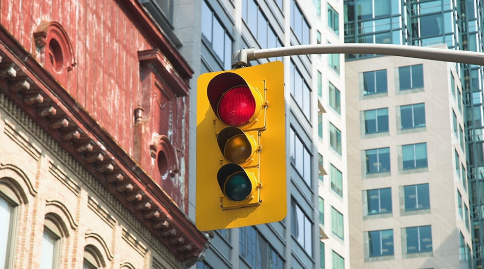

This project is an analysis of the red light camera program for the City of Toronto.

### Project Outline
1. Proposal - project background, initial research question, intended modelling analysis, schedule/timelines.
2. Sprint 1 - data gathering, data cleaning, and exploratory data analysis (EDA).
3. Sprint 2 - main modelling/analysis.
4. Sprint 3 - final report and presentation of highlights of report.
